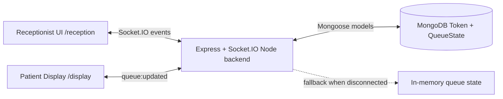

# Architecture

## Data Flow

1. A client loads and fetches `GET /api/queue` for the first snapshot.
2. Reception emits `addPatient`, `callNext`, or `setAvgTime`.
3. The backend mutates queue state in `queueService`.
4. The backend emits `queue:updated` to every connected socket.
5. Receptionist and patient display re-render from the same payload.
